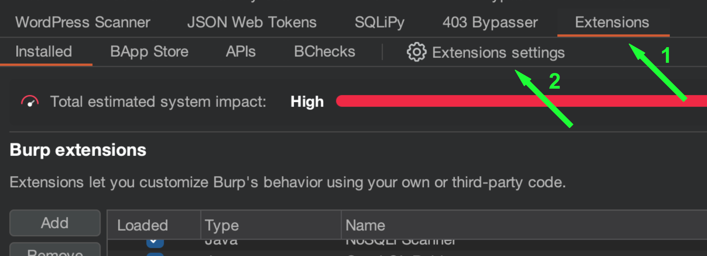
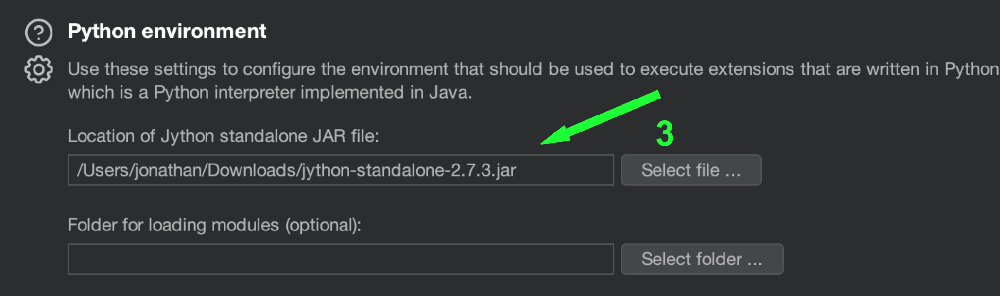
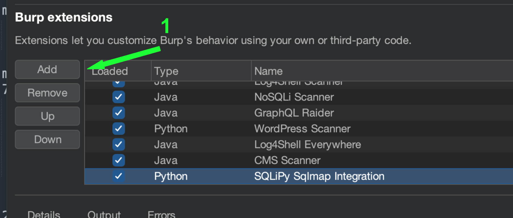
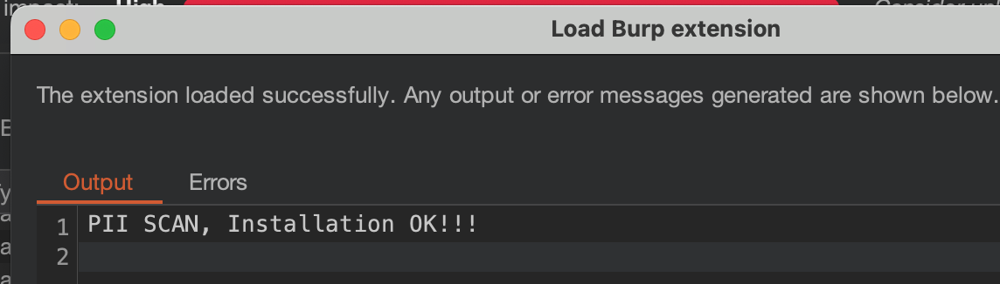
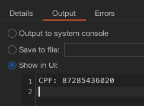
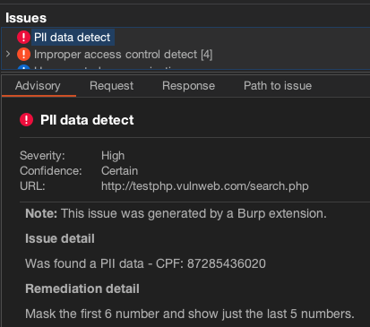

# Burp Extension - PII Scanner

Extension that looking for PII data in passive requests.

## Table of contents

* [Installation](#installation)
* [Usage](#usage)

## Installation

  1. Download [Jython](https://www.jython.org/download) standalone JAR, for example version [2.7.3](https://repo1.maven.org/maven2/org/python/jython-standalone/2.7.3/jython-standalone-2.7.3.jar)
  2. Go to **Extensions->Extensions settings**. Set path inside `Location of Jython standalone JAR file` in Python enviroment.

  

  

  3. Unzip the burp extension PII-SCAN.zip
  4. Go to **Extensions->Installed**. Click **Add**. Set `Extension type` to `Python`. Set `burp_pii_scan.py` inside `Extension file` and press Next button.

  ## Usage

[Install](#installation) extension. Browse sites through Burp proxy. If the extension found PII data it will create a log in console, create a issue with the data leaked and how to remediate.

